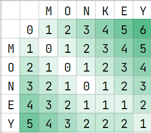
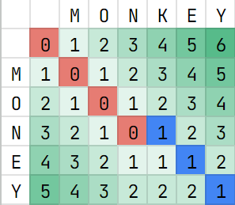
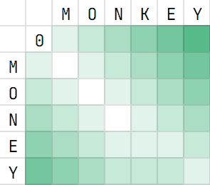
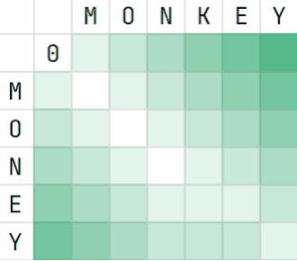
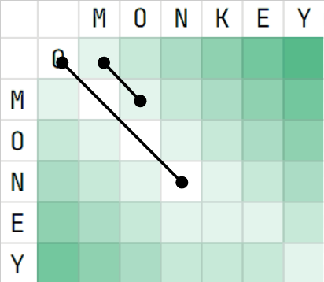
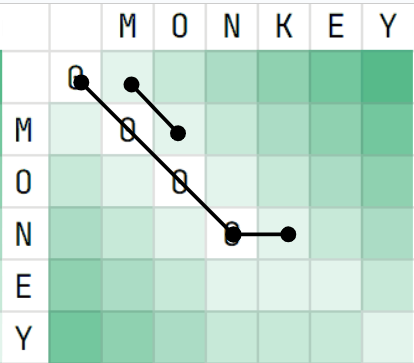

# Sequence Alignment

## Problem: The Edit Distance between two strings

The Edit Distance problem is defined as how many **operations** it takes to transform one string into another. These operations include insertions, substitutions, and deletion.

Example:
We want to find the edit distance between the strings ```atggc``` and ```cggc```. Delete ```a``` then substitute ```t``` for ```c```.

```atggc -> tggc -> cggc```

Thus, the edit distance is 2, as it took two operations.

### Recursive formulation

How do we do this algorithmically?

Well, let's model the three different types of changes. Suppose we have the strings $a = a_1a_2...a_i$ and $b = b_1b_2...b_j$. Consider the very first characters, $a_i$ and $b_j$, and we are counting how many edits it takes to transfrom a to b.

1. If $a_j = b_i$, then it's pretty clear that $editDistance(a_1...a_i, b_1...b_j) = editDistance(a_1...a_{i-1}, b_1...b_{j-1})$, because we don't have to edit anything.
2. Otherwise, let's try modeling a substitution. In this case, we swap out $a_i$ for $b_j$, giving us $1 + editDistance(a_1...a_{i-1}b_j, b_1...b_j) = 1 + editDistance(a_1...a_{i-1}, b_1...b_{j-1})$, by the above formulation, as the $i$ th element of a equals the $j$ th element of b, which is $b_j$. Also note that we're adding 1, because the swap itself is an operation and increases edit distance
3. Now, a deletion. We delete the ith of the first string, giving us $1 + editDistance(a_1...a_{i-1}, b_1...b_j)$. 
4. Finally, let's try an insertion. This means we append $b_j$, giving us $1 + editDistance(1 + editDistance(a_1...a_ib_j, b_1...b_j)$, which is equivalent to $1 + editDistance(a_1...a_i, b_1...b_{j-1})$. Note that this is equivalent to deleting the last letter of the second string.


Thus, the full algorithm, written out in recursion (in python):

```py
def edit_distance(string1, string2):
    # if either of the strings are empty, then we have to delete
    # all of the members of the other one
    if len(string1) == 0:
        return len(string2)
    
    if len(string2) == 0:
        return len(string1)

    if string1[0] == string2[0]:
        # if you're unsure about syntax, ask ChatGPT
        return edit_distance(string1[:-1], string2[:-1])
    else:
        substitution = 1 + edit_distance(string1[:-1], string2[:-1])
        deletion = 1 + edit_distance(string1[:-1], string2)
        insertion = 1 + edit_distance(string1, string2[:-1])

        return min(substitution, deletion, insertion)
```

Unfortunately, this algorithm suffers from being unbelievably slow. If the strings are distant, we call end up with three recursive calls. In the worst case, this makes our algorithm $O(3^n)$, or exponential.

### Making it Faster
The main issue that is slowing down this algorithm is the duplicate computation. For each ```i, j``` we end up calling ```edit_distance(string1[..i], string2[..j])``` multiple different times. We call it from trying to compute the substitution distance when computing ```edit_distance(string1[..i-1], string2[..j-1])```, we call it from trying to compute deletion distance when computing ```edit_distance(string1[..i], string2[..j-1])```, etc. And each of these calls is repeated as well, which is what leads to the exponential behavior.

We can speed it up using a tactic called dynamic programming. For every ```i, j```, once we compute ```edit_distance(string1[..i], string2[..j])```, we can store it in a matrix at index `i, j`. Then, we can just look it up at the index, instead of calling the function. 

It's hard to explain exactly how this looks without a video, so I'm linking one here.

[](https://youtu.be/Dd_NgYVOdLk?t=593 "Edit Distance between 2 Strings | The Levenshtein Distance Algorithm + Code")

This is the standard algorithm for finding edit distance. It's time and space complexity are both $O(mn)$, meaning it scales quadratically. But can we make it even better?

## Even faster?


Let's draw the alignment grid for the strings "monkey" and "money."





Notice anything?

Firstly, when two strings are very similar, they tend to form "streaks" along diagonals. 



The way that the grid ends up being filled out is actually really dependent on these streaks. For example, most of the elements with edit distance 1 are just "extensions" on the long streak with edit distance 0.

Let's try to formulate an algorithm that takes advantage of this. We will iterate over edit distance, and try to compute each element that has edit distance $0, 1, 2...$ respectively. We will refer to the set of all matrix elements with edit distance $n$ as the $n$th wave.

For each wave, you compute the members of the next wave with two key steps:

1. Expand all existing members using the three operations, substitution, deletion and insertion.
2. Follow existing streaks for as long as you possibly can.



Initially, this looks identical, if not less efficient than normal alignment. However, once we tinker with it a little more, it will prove to be much much faster.

First, let's take a detour. We will continue to iterate over edit distance, except this time, we are computing "edit paths." Like the wave front algorithm, in each iteration, the path will extend as far as possible along a matching diagonal, then expand, representing insertions, deletions, and substitutions.

 

 If you look closely at the animation, you can see each one of these stages: the initial path extends along "MON," and then expands, then another path extends along "EY." 

In order to compute the edit distance, we initialize one of these paths for every single diagonal, and have them race to the bottom right. 

However, there are a few more optimizations we can perform. 

Firstly, we don't have to keep track of every single path. Instead, we can keep track of the path-endings, represented by the dots. Notice how this is similar to the wavefront algorithm: For the $n$th "path ending" , the dots corresponds to the furthest-reaching element of wave $n$ on each diagonal. 

Additionally, to save time and space, we can do a little bit of pruning. Let's suppose that we initialize a path on diagonal $d$. After $n$ iterations (i.e. edit distance $n$), the unlucky diagonal didn't have a single match. However, its neighbor path was able to get many, many matches. The neighbor path then extends a little sub-path onto diagonal $d$, representing an insertion or deletion operation, and overtakes it. 




Algorithmically, it's impossibly for our unlucky path to overtake the more dominant path. Thus, we can basically forget about it.

When combined with only storing the ends of paths (or the wave-fronts), this means that we only actually have to store an array of numbers, representing exactly how far we've extended each path. Then, when the time comes, each "path" can check its neighbors to see if it's possible for that neighbor to overtake it. If so, it can update its own length accordingly. Otherwise, it keeps extending.

Thus, in each iteration, we do the following:

1. For each path, check if it can be overtaken by substitution or deletion operations from any of its neighbors. Otherwise, increment its value by 1, representing a substitution
2. Then, extend as far as possible on a matching diagonal, similar to how we did for the original wave algorithm.

This, our pseudocode:

```py
def WFA(string1, string2):
    wavefront = [0; max(len(string1), len(string2))]
    
    loop:
        # compute the next wavefront. Start by accounting for edits
        next_wavefront = wavefront 
        for i in range(len(wavefront)):
            substitution = wavefront[i] + 1
            deletion = wavefront[i - 1] + 1
            insertion = wavefront[i + 1] + 1
        
            next_wavefront[i] = min(substitution, deletion, insertion)
        
        # then, extend as far as possible along matching diagonals
        # remember: next_wavefront[i] contains DIAGONAL values. You
        # will have to implement a custom function determines the 
        # string index for a given diagonal
        for i in range(len(wavefront)):
            x = get_x(i, wavefront[i])
            y = get_y(i, wavefront[i])
            while string1[x] == string2[y]:
                wavefront[i]++

```

Obviously, implement this in a more efficient way. There are other efficiency-related implementation details, but the main algorithm is the most important.
